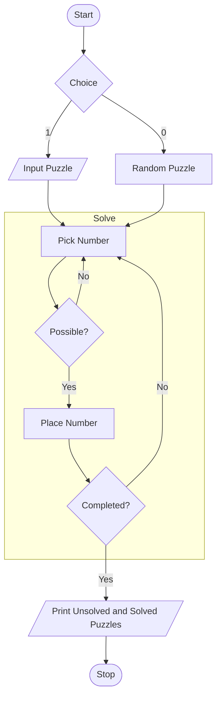

# Details

## Name

Ahmed Thahir

## ID

2020A7PS0198U

## Group Name

LCS-G28

## Paper Title

SUDOKU, LOGIC AND PROOF

## Journal

Parabola Volume 47, Issue 2 (2011) 

## Year of Publishing

2011

# Abstract

Sudoku is a very popular puzzle game. However, a common misconception is that the game requires no mathematics. This report analyzes the logic behind Sudoku, and mathematical proofs associated with the game. The report concludes that while arithmetic is not required in Sudoku, mathematical logic is applicable. The major logical proofs used are ‘Direct Proof’, ‘Proof by Cases’ and ‘Proof by Contradiction’. The report also shows how a Sudoku puzzle can be solved using a computer program in Python.

# Acknowledgements

I would like to thank Dr. Rahul Sankaramenon and Dr. Siddhaling Urolagin for providing me with the opportunity to perform this project, and for their guidance and supervision throughout the project. Furthermore, the concepts taught by them greatly helped with the execution of this research project. I would also like to thank my friends who helped me choose the topic and guided me with this report. Lastly, I would like to thank my parents and sibling who have always supported me.

[toc]


# Introduction

## Authorization

This report on ‘The Logic behind Sudoku’ has been authorized by Dr. Rahul Sankaramenon, Assistant Professor in the Department of Computer Science, at BITS Pilani Dubai Campus, on 12 November 2021.

## Historical Background

Sudoku is an extremely-popular puzzle game. It consists of a $9 \times 9$ grid, ie nine rows, nine columns, and nine $3 \times 3$ subsquares. Every row, every column, and every subsquare contains a number from $1-9$ exactly once. There are a large number of variations for Sudoku puzzles, but a step-wise method can be used to solve the problem with minimal effort. The below image shows an example sudoku puzzle.


A common misconception is that the game does not require any mathematics. An Australian newspaper even used to print the following next to its Sudoku puzzles:

> The game requires no mathematics and can be solved by logic alone

This is not true - the game requires logic and any kind of logic is Mathematics. Hence, the game infact requires no arithmetic, but requires Mathematics.

## Objective

To analyze the mathematical logic behind the puzzle game Sudoku

## Scope and Limitations

This report 

- only analyzes a few concepts, for the sake of simplicity and time-constraints.
- does not explain proofs that are not relevant to the game of Sudoku
- does not contain the logical proof tableaux for the program mentioned

## Methodology

1. Journals
2. Research Papers
2. Computer Programs
3. Videos

## Report Preview

Including the ‘Introduction’, the report is divided into five sections. The ‘Discussion’ analyzes the problem at hand, and focuses on the theory behind Sudoku. The ‘Program’ section shows and explains a program to solve sudoku puzzles. The ‘Flowchart’ visualizes the working of the program in a step-by-step manner. The ‘Conclusion’ sums up the discussions and other sections of the report.

# Discussion

## Mathematical Representations

In order to understand the problem in hand more logically, the following representations can be used. In this report, three kinds of representation are used:

1. Propositional logic
2. Predicate logic
3. Temporal logic

### Symbols

The following table shows the symbols used for simplification, and their meaning.

|  Symbol  | Represents                                                   |
| :------: | ------------------------------------------------------------ |
|   $P$    | **P**uzzle                                                   |
|   $n$    | **n**umber                                                   |
| $B(x,y)$ | predicate that returns true if $x$ **b**elongs to $y$        |
|  $p(x)$  | function that returns the **p**osition of $x$                |
|  $r(x)$  | function that returns the **r**ow of $x$                     |
|  $c(x)$  | function that returns the **c**olumn of $x$                  |
|  $s(x)$  | function that returns the **s**ubsquare of $x$               |
|  $o(x)$  | function that returns an integer number from 1-9 **o**ther than $x$ |

### Formulae

Any number in a sudoku puzzle can only take integer values from 1-9.
$$
\forall n \quad \Big(n \in P \to n \in [1, 9] \Big)
$$

Any number occurs only once in each row, column, and $3 \times 3$ sub-square.

- Hence, the occurrence of a number in a row eliminates the the possibility of future occurrence of the same number in the same row.
- Similarly, we can conclude the same for columns and sub-squares

$$
\begin{aligned}
\forall n \quad A
\Bigg(

B \Big( n, r(n) \Big) \to G \bigg(\lnot B \Big( n, r(n) \Big) \bigg) &, \\

B \Big( n, c(n) \Big) \to G \bigg(\lnot B \Big( n, c(n) \Big) \bigg) &, \\

B \Big( n, s(n) \Big) \to G \bigg(\lnot B \Big( n, s(n) \Big) \bigg) &

\quad \Bigg),

\quad n \in [1, 9]
\end{aligned}
$$

The number placed at a position for a particular solution of the puzzle is unique. Hence, the placement of any number at a particular position in the puzzle eliminates the possibility of any other number also being placed at that position. We can then conclude that
$$
\forall n \quad
AG \Bigg(

\lnot B 
\bigg(
o(n), p(n) 
\bigg)

\Bigg) , \quad
n \in [1, 9]
$$


## Mathematical Proofs

Three main logical proofs are used in solving a Sudoku puzzle. A ‘deduction’ is the conclusion that is drawn using these proofs.

An important condition for obtaining correct solutions using these proofs is to **never** place any number in any position through guessing. From a false assumption, you can correctly prove true statements and also correctly prove false statements; this means that anything proved using a false assumption is unreliable. Hence, any incorrect step will lead to every future step to be unreliable, and very possibly, incorrect.

Let

- $s$ denote a correct step
- $\lnot s$ denote an incorrect step

$$
\forall s \quad AG \Big(\lnot s \to F(\lnot s) \Big)
$$

Even if the player realizes that a mistake has been made, it may be nearly impossible to track the original mistake. The player might have to restart the entire game due to this. This is why it is very important to proceed very carefully, just like performing any mathematical proof, ensuring that each and every step is correct.

### Direct Proof

A deduction is obtained purely by using whatever we know to be definitely true.

With reference to Sudoku, we first pick a position in the puzzle. If only one particular number is possible at that position, we place the number there.

### Proof by Cases

It is also called as ‘Proof by exhaustion of cases’. Here, a deduction is obtained through cases of possibilities.
$$
\frac{
  \begin{bmatrix}
    \phi_1 \\
    \vdots \\
    \bot
  \end{bmatrix}
  \begin{bmatrix}
    \phi_2 \\
    \vdots \\
    \bot
  \end{bmatrix}
	\quad
	\dots
	\quad
  \begin{bmatrix}
    \phi \\
    \vdots \\
    T
  \end{bmatrix}
}{\phi}
$$


With reference to Sudoku, we first pick a number. We observe other rows, columns, and subsquares of the puzzle. We then obtain cases for the positions of a particular number. Finally, we obtain the position for that number by ‘exhausting’ all other cases. Here, $\phi_1, \phi_2, \dots, \phi$ are the possible positions for a number.

### Proof by Contradiction

A deduction is obtained by assuming the opposite of what we require, and then proving that to be false. This means that the assumption was wrong and the opposite of the assumption is true, as the negation of falsehood is true, ie $\lnot(\bot) = T$. Hence, a solution is obtained. This can be represented as:
$$
\frac{
\begin{bmatrix}
\lnot \phi \\
\vdots \\
\bot
\end{bmatrix}
}{\phi}
$$
With reference to Sudoku, we first pick a number. Secondly, we pick a position. Thirdly, we assume that this number should **not** be placed in this position. We then observe and proceed with the other rows, columns, and the subsquares, until we obtain a contradiction. We can then conclude that this number should infact be placed in the position we initially assumed it not to be placed at. Here, $\phi$ is the position of a number, and $\lnot \phi$ is every other position.

### Other Proofs

Though other proofs such as ‘Proof by Contrapositive’ and ‘Principle of Mathematical Induction’ are two very useful mathematical proofs, they are not very helpful in solving Sudoku puzzles. Hence, they have not been discussed here.

# Program

This program works at solving a given sudoku puzzle, using Python. Though the program was obtained online, it has been modified in order to enhance the usability. The user can either input their own sudoku puzzle, or use one of the given default puzzles.

The program works using the concepts of

- recursion
  a function keeps calling itself, until the task is achieved
- backtracking
  a recursive technique to solve problems by trying to obtain a solution incrementally, eliminating those solutions that do not satisfy the condition at any point. You keep proceeding with a solution, until you face a contradiction; you then ‘backtrack’ (undo) and try another solution. Keep doing this until the final solution is obtained.

## Programming Language

Python was the the programming language used for this project. Python is a high-level open-source language, with advanced features, which makes it suitable for reproducible and accessible research and development. According to Python’s documentation page,

> Python is an interpreted, object-oriented, high-level programming language with dynamic semantics. The Python interpreter and the extensive standard library are available in source or binary form without charge for all major platforms, and can be freely distributed.

## Development Environment

Jupyter Notebook

## Code

This code is available on my [Github repository](https://github.com/AhmedThahir/logic).

### Importing Libraries

The `random` library is used to select a puzzle from the list of default ones.

``` python
import random
```

### Default Puzzles

``` python
a = [
    [7,8,0, 4,0,0, 1,2,0],
    [6,0,0, 0,7,5, 0,0,9],
    [0,0,0, 6,0,1, 0,7,8],
    
    [0,0,7, 0,4,0, 2,6,0],
    [0,0,1, 0,5,0, 9,3,0],
    [9,0,4, 0,6,0, 0,0,5],
    
    [0,7,0, 3,0,0, 0,1,2],
    [1,2,0, 0,0,7, 4,0,0],
    [0,4,9, 2,0,6, 0,0,7]
]

b = [
    [4,0,6, 5,0,2, 8,0,9],
    [0,0,0, 0,4,0, 0,3,0],
    [0,0,0, 0,0,0, 0,0,5],
    
    [6,0,0, 8,0,0, 1,0,0],
    [5,0,0, 0,7,0, 0,8,0],
    [3,0,2, 9,0,4, 0,6,0],
    
    [0,2,0, 6,0,0, 0,0,1],
    [0,0,0, 0,5,3, 9,4,0],
    [8,3,0, 0,9,0, 0,0,2]
]

# hard
c = [
    [0,0,0, 8,0,0, 0,0,0],
    [7,8,9, 0,1,0, 0,0,6],
    [0,0,0, 0,0,6, 1,0,0],
    
    [0,0,7, 0,0,0, 0,5,0],
    [5,0,8, 7,0,9, 3,0,4],
    [0,4,0, 0,0,0, 2,0,0],
    
    [0,0,3, 2,0,0, 0,0,0],
    [8,0,0, 0,7,0, 4,3,9],
    [0,0,0, 0,0,1, 0,0,0]
]

puzzles = [
    a,
    b,
    c
]
```

### Functions

The `display()` displays the sudoku grid in a ‘prettified’ manner

```python
def display(board):
    for i in range(9):
        for j in range(9):
            if(board[i][j] == 0):
                print("X", end =" ")
            else:
                print(board[i][j], end =" ")

            if( j+1 == 3 or j+1 == 6 or j+1 == 9 ):
                print("", end = " ")

        if( i+1 == 3 or i+1 == 6 or i+1 == 9 ):
                print()
        print()
```

The `possible()` function checks if it possible to place a number in a particular and row, column

``` python
def possible(x, y, num):
    global board
    for i in range(0,9):
        if board[i][y] == num:
            return False
    for j in range(9):
        if board[x][j] == num:
            return False
    x0 = (x//3)*3
    y0 = (y//3)*3

    for i in range(3):
        for j in range(3):
            if board[x0 + i][y0 + j] == num:
                return False
    return True
```

The `solve()` function fills in the missing values with the help of the `possible()` function and finally prints it using the `display()` function

``` python
def solve():
    global board
    for y in range(9):
        for x in range(9):
            if board[y][x] == 0:
                for num in range(1,10):
                    if possible(y,x,num):
                        board[y][x]=num
                        solve()
                        board[y][x] = 0
                return
    display(board)
```

### Input/Selecting Puzzle

The user has inputs 1 for a custom puzzle and 0 for a random puzzle. The custom puzzle is inputted row-wise.

``` python
o = int(input("""
    Enter 
    - 1 for custom puzzle, or
    - 0 for a random puzzle
    """))

if(o == 0):
    board = random.choice(puzzles)
else:
    print("""
    Enter
    - 1-9     for filled places
    - 0       for empty places
    - <space> to separate places
    """)
    
    board = list()
    print()
    for i in range( 9 ):
        row = input("Row " + str(i+1) + "\t")
        board.append(list(
            map(int, row.split())
        ))
        print()
```

### Display

Now, the unsolved and solved puzzles are printed.

``` python
print("\033[1m" + "Before Solving" + "\033[0m")
display(board)

print()

print("\033[1m" + "After Solving" + "\033[0m")
solve()
```

## Output

An example output is shown below

    Enter 
    - 1 for custom puzzle, or
    - 0 for a random puzzle
    0

```
Before Solving
7 8 X  4 X X  1 2 X  
6 X X  X 7 5  X X 9  
X X X  6 X 1  X 7 8  

X X 7  X 4 X  2 6 X  
X X 1  X 5 X  9 3 X  
9 X 4  X 6 X  X X 5  

X 7 X  3 X X  X 1 2  
1 2 X  X X 7  4 X X  
X 4 9  2 X 6  X X 7  


After Solving
7 8 5  4 3 9  1 2 6  
6 1 2  8 7 5  3 4 9  
4 9 3  6 2 1  5 7 8  

8 5 7  9 4 3  2 6 1  
2 6 1  7 5 8  9 3 4  
9 3 4  1 6 2  7 8 5  

5 7 8  3 9 4  6 1 2  
1 2 6  5 8 7  4 9 3  
3 4 9  2 1 6  8 5 7  
```

# Flowchart



# Conclusion

This report concludes that

1. No arithmetic is required in Sudoku
2. Mathematical logic is applicable
3. The major logical proofs used are
   1. ‘Direct Proof’
   1. ‘Proof by Cases’
   2. ‘Proof by Contradiction’
4. Solving a sudoku puzzle using a computer program is possible using ‘backtracking’

# Bibliography

- Greenhill, Catherine. “Sudoku, Logic and Proof.” Accessed November 22, 2021. https://www.parabola.unsw.edu.au/2010-2019/volume-47-2011/issue-2/article/sudoku-logic-and-proof.
- Berthier, Denis. The Hidden Logic of Sudoku. Lulu. com Raleigh, NC, 2007.
- Computerphile. Python Sudoku Solver - Computerphile, 2020. https://www.youtube.com/watch?v=G_UYXzGuqvM.
- Mohd Saquib. Solving Sudoku Using Python, 2020. https://www.youtube.com/watch?v=DpEQVsUpBb4.
- Stellmach, Tim. *Sudoku Layout*. September 12, 2006. SVG version of “Sudoku-by-L2G-20050714.gif,” a Sudoku layout generated by the GNU program Su Doku Solver and contributed in the public domain by Lawrence Leonard Gilbert. Created in Inkscape. https://commons.wikimedia.org/wiki/File:Sudoku-by-L2G-20050714.svg.
- “Python Documentation.” Accessed December 10, 2021. https://docs.python.org/3/